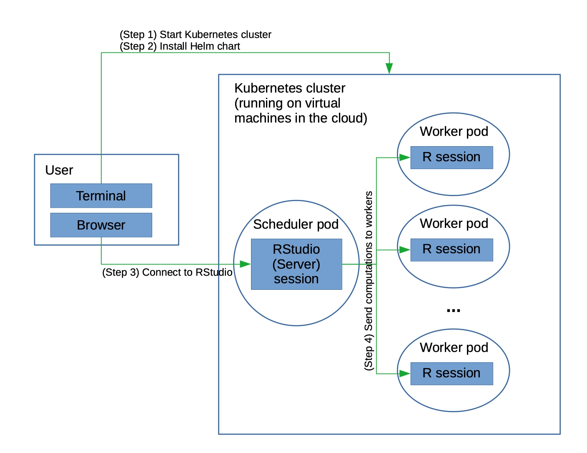

# future-kubernetes

Instructions for setting up and using a Kubernetes cluster for running R in parallel using the future package.

A primary use of this would be to run R in parallel across multiple virtual machines in the cloud. Kubernetes provides the infrastructure to set things up so that the main R process and all the R workers are running and able to communicate with each other. 

At the moment, the instructions make use of Google Kubernetes Engine or Amazon's Elastic Kubernetes Service, but apart from the initial step of starting the cluster, I expect the other steps to work on other cloud providers' Kubernetes platforms.

The future package provides for parallel computation in R on one or more machines.

- <https://cran.r-project.org/package=future>
- <https://github.com/HenrikBengtsson/future>

These instructions rely on two Github repositories under the hood:

  - A [Docker container](https://github.com/paciorek/future-kubernetes-docker) that (slightly) extends the `rocker/rstudio` Docker container to add the `future` package.
  - A [Helm chart](https://github.com/paciorek/future-helm-chart) based in large part on the [Dask helm chart](https://github.com/dask/helm-chart) that installs the Kubernetes pods, one (scheduler) pod running RStudio Server and acting as the main R process and (by default) four pods, each running one R worker process.

Eventually, I may add additional material to this repository, but for now the repository only contains these instructions.
  
## Setting up and using your Kubernetes cluster

The graphic below gives an overview of the workflow and components of the setup.



### Installing software to manage the cluster

If using Google cloud, you'll need to [install the Google Cloud command line interface (CLI) tools](https://cloud.google.com/sdk/install). Once installed you should be able to use `gcloud` from the terminal. Alternatively, if using AWS, you'll need to [install the AWS EKS command line utility](https://docs.aws.amazon.com/eks/latest/userguide/eksctl.html). You may also need to [install the AWS command line interface (CLI) tools](https://docs.aws.amazon.com/cli/latest/userguide/cli-chap-install.html) and possibly run `aws configure`. Once installed you should be able to use `eksctl` from the terminal.

You'll also need to [install `kubectl`](https://kubernetes.io/docs/tasks/tools/install-kubectl) to manage your cluster.

Finally you'll need to [install `helm`](https://helm.sh/docs/intro/install), which allows you to install packages on your Kubernetes cluster to set up the Kubernetes pods you'll need. These instructions assume either Helm version 3 (e.g., Helm 3.3.4 for [Mac](https://get.helm.sh/helm-v3.3.4-darwin-amd64.tar.gz) or [Windows](https://get.helm.sh/helm-v3.3.4-windows-amd64.zip) or Helm version 2 (e.g., Helm 2.16.3 for [Mac](https://get.helm.sh/helm-v2.16.3-darwin-amd64.tar.gz) or [Windows](https://get.helm.sh/helm-v2.16.3-windows-amd64.zip). 

Note that you may be able to use the [Google Cloud Shell](https://shell.cloud.google.com) rather than installing the Google Cloud CLI or kubectl (but figuring out to set up port forwarding between your local machine and Google Cloud Shell would need to be addressed in order to connect to the RStudio Server instance). As far as AWS CloudShell, it doesn't appear to have `eksctl` or `kubectl` installed.

### Starting a Kubernetes cluster

In general you'll want to have as many R workers (set via the Helm chart - see below) as total CPUs (set here) on the cluster. 

#### Google

Here is an example invocation to start up a Kubernetes cluster on Google Kubernetes Engine. 

```
gcloud container clusters create \
  --machine-type n1-standard-1 \
  --num-nodes 4 \
  --zone us-west1-a \
  --cluster-version latest \
  my-cluster
```

This asks for four n1-standard-1 (1 CPU) virtual machines (which I'll call 'nodes'). If you had instead asked for `n1-standard-2` (two CPUs per node) and four nodes, you'd want to have eight R workers.

#### Amazon

Alternatively, here is an example invocation to start up a Kubernetes cluster on Amazon's Elastic Kubernetes Service. Note that I've found starting a cluster on AWS can take something like 30 minutes, so I generally suggest using Google Cloud.

```
eksctl create cluster \
--name my-cluster \
--region us-west-2 \
--nodegroup-name standard-workers \
--node-type t2.small \
--nodes 4 \
--nodes-min 1 \
--nodes-max 4 \
--ssh-access \
--ssh-public-key ~/.ssh/ec2_rsa.pub \
--managed
```

This asks for four t2.small (1 CPU) virtual machines. If you had instead asked for `t2.medium` (two CPUs per node) and four nodes, you'd want to have eight R workers.

### Configuring your Kubernetes cluster

Now you need to run `kubectl` commands to modify your cluster. 

First we need to give our account permissions to perform administrative actions:

```
kubectl create clusterrolebinding cluster-admin-binding \
  --clusterrole=cluster-admin
```

Optionally, next you can set things up so that one could run `kubectl` within the Kubernetes pods. That shouldn't in general be needed for the approach documented here, but it might be useful if extending this work or for diagnostic/monitoring work.

```
## Optional!
kubectl create rolebinding all-access \
   --clusterrole=cluster-admin \
   --serviceaccount=default:default
```

The following commands are only needed in older versions of Helm (Helm < 3.0.0), as Helm >= 3.0.0 does not use Tiller.

```
## Only needed in Helm version < 3.0.0
kubectl --namespace kube-system create serviceaccount tiller
kubectl create clusterrolebinding tiller --clusterrole cluster-admin --serviceaccount=kube-system:tiller
helm init --service-account tiller --wait
kubectl patch deployment tiller-deploy --namespace=kube-system --type=json --patch='[{"op": "add", "path": "/spec/template/spec/containers/0/command", "value": ["/tiller", "--listen=localhost:44134"]}]'
```

Now we're ready to install the Helm chart that creates the pods (essentially containers) on the Kubernetes cluster. There will be one (scheduler) pod running RStudio Server and (by default) four pods running R workers. Make sure to choose your own name in place of <name-of-release>.

```
git clone https://github.com/paciorek/future-helm-chart
tar czf future-helm.tgz -C future-helm-chart .
helm install --wait <name-of-release> ./future-helm.tgz
```

Note that in earlier versions of Helm (before version 3) one would not include 'name-of-release' and Helm would provide a name for the release (which will be of a form something like `ardent-porcupine`). A 'release' is an instance of a chart running in a Kubernetes cluster. In newer versions of Helm, you need to provide the name.

The `--wait` flag tells helm to wait until all the pods have started. Once that happens, you'll see a message about the release and how to connect to the RStudio interface. 

Note: Below I have instructions for installing additional R packages on your cluster. If you install any packages that take a substantial amount of time (e.g., anything relying on Rcpp), it could take multiple minutes or more for the pods to start up. The RStudio interface would NOT be available during this time.

You can check the pods are running with:

```
helm status <name-of-release>
kubectl get pods
```

If you don't plan on modifying the chart, you can install the chart directly from the GitHub repository without cloning the repositoring and untarring it:

```
VERSION=0.1.1
helm repo update
helm install --wait <name-of-release> https://github.com/paciorek/future-helm-chart/archive/${VERSION}.tar.gz 
```

### Connecting to the the RStudio Server instance running in your cluster.

Once your pods have finished starting up, you can connect to your cluster via the RStudio Server instance running in the main pod on the cluster.

Follow the instructions given in the message shown after you ran `helm install` above, namely:

```
  export RSTUDIO_SERVER_IP="127.0.0.1"
  export RSTUDIO_SERVER_PORT=8787
  kubectl port-forward --namespace default svc/future-scheduler $RSTUDIO_SERVER_PORT:8787 &
```


You can then connect to the RStudio Server instance by connecting to 127.0.0.1:8787 in a web browser tab. You can then login to RStudio using the username `rstudio` and password `future`.

What's happening is that port 8787 on your local machine is forwarding to the
port on the main pod on which RStudio Server is listening (which is
also port 8787). So you can
just act as if RStudio Server is accessible directly on your local machine.

One nice thing about this is that there is no public IP address for someone to maliciously use
to connect to your cluster. Instead the access is handled securely entirely through `kubectl` running
on your local machine. (One cautionary note is that other users on the same local machine can connect to 127.0.0.1:8787.) However, it also means that you couldn't easily share your cluster with a
collaborator. For details on configuring things so there is a public IP, please see [my GitHub repository](https://github.com/paciorek/future-kubernetes#connecting-to-the-rstudio-instance-when-starting-the-cluster-from-a-remote-machine).


Note that this approach to connecting to the RStudio Server interface requires that you have run the commands above on the same machine as where you are running your web browser. If you'd like to be able to run the commands above on a different machine (say a server somewhere) but still be able to connect from the browser on your local machine (say your laptop), see the [notes below](#connecting-to-the-rstudio-instance-when-starting-the-cluster-from-a-remote-machine).

### Setting up the future `plan`

Now you should be able to do the following in RStudio to create your plan. This will start up the R workers and connect them to the main R process. 

```{r}
library(future)
plan(cluster, manual = TRUE, quiet = TRUE)
```

Note that the Helm chart sets an environment variable in the scheduler pod's `Renviron` file based on the number of worker pod replicas. Since that environment variable is used by the future package (via `parallelly::availableCores()`), this ensures that you start only as many future workers as you have worker pods. However, if you modify the number of worker pods after installing the Helm chart, you may need to set the `workers` argument to `plan()` manually.

### Example usage of your cluster

Once you've set up your plan, the following example should run in parallel.

```{r}
library(future.apply)
output <- future_lapply(1:40, function(i) mean(rnorm(1e7)), future.seed = TRUE)
```

To check that your code is actually running in parallel, one can run
the following test and see that the result returns the names of
distinct worker pods.

```{r}
library(future.apply)
future_sapply(seq_len(nbrOfWorkers()), function(i) Sys.info()[["nodename"]])
```


### Working with files

Note that `/home/rstudio` will be your default working directory in RStudio and the RStudio process will be running as the user `rstudio`.

You can use `/tmp` and `/home/rstudio` for files, both within RStudio and within code running on the workers, but note that files (even in `/home/rstudio`) are not shared between workers nor between the workers and the RStudio Server pod.

To make data available to your RStudio process or get output data back to your laptop, you can use `kubectl cp` to copy files between your laptop and the RStudio server pod. Here's an example of copying to/from `/home/rstudio`:

```
## create a variable with the name of the scheduler pod
export SCHEDULER=$(kubectl get pod --namespace default -o jsonpath='{.items[?(@.metadata.labels.component=="scheduler")].metadata.name}')

## copy a file to the scheduler pod
kubectl cp my_laptop_file ${SCHEDULER}:home/rstudio/

## copy a file from the scheduler pod
kubectl cp ${SCHEDULER}:home/rstudio/my_output_file .
```

Of course you can also interact with the web from your RStudio process. 

### Removing your Kubernetes cluster

Make sure to do this or the cloud provider will keep charging you, hour after hour after hour.

```
## Google Cloud
gcloud container clusters delete my-cluster --zone=us-west1-a
## AWS
eksctl delete cluster my-cluster
```

Note that on AWS, in my experience, deletion can sometimes fail or not all the resources allocated are deleted, which may cause you to continue to be charged. Please see the troubleshooting section below for more details.

## Modifying your cluster

Some simple modifications are:

  - increasing the number of R workers
  - adding additional R packages to your cluster
  - changing the RStudio password

For the most part you'll want to make these modifications by editing the files in the `future-helm-chart` directory BEFORE you run `helm install`.

However as illustrated for increasing the number of R workers, you can use `kubectl edit deployment future-worker` or `kubectl edit deployment future-scheduler` to modify the properties of the worker or scheduler pods on the fly while they are running. In some cases new pods will be created in place of the original pods.

### Increasing the number of R workers

To increase the number of R workers (before running `helm install` above), go into the  `future-helm-chart` directory (which you created following the instructions above) and edit the [values.yaml](https://github.com/paciorek/future-helm-chart/blob/master/values.yaml) file. In particular, you'll need to modify the `replicas` line that is in the 'worker' stanza (the block of code under `worker:`. Don't modify the 'replicas' line in the 'scheduler' stanza.

You can also modify the number of workers after having run `helm install` by invoking the following:

```
kubectl edit deployment future-worker
```

This will put you into an editor and you can modify the `replicas` line in the `spec` stanza. Once you exit the editor, your new worker pods should start. If you rerun `helm status <name-of-release>`, you should see the additional worker pods running.

Note that doing the above to increase the
number of workers would probably only make sense if you also modify
the number of virtual machines you start your Kubernetes cluster with
such that the total number of cores across the cloud provider compute
instances matches the number of worker replicas.

You may also be able to modify a running cluster. 
For example you could use `gcloud container clusters resize`.
I haven't experimented with this.


### Adding additional R packages

Go into the `future-helm-chart` directory (which you created using the directions above) and edit the `values.yaml` file. Simply modify the lines that look like this:

```
  env:
  #  - name: EXTRA_R_PACKAGES
  #    value: data.table
```

by removing the "#" comment character and putting the R packages you want installed in place of 'data.table', with the names of the packages separated by spaces.

In many cases you may want these packages installed on both the scheduler (where RStudio Server runs) and on the workers. If so, make sure to modify the lines above in both the `scheduler` and `worker` stanzas.

WARNING: installing R packages can take substantial time. This is done when the pods are started, so the RStudio interface will not be available until all packages are installed in the scheduler pod.

### Changing the RStudio password

Simply modify the `rstudio_password` value in `values.yaml` file in the `future-helm-chart` directory.

### Connecting to the RStudio Server instance when starting the cluster from a remote machine

The Helm chart as provided does not allow one to connect to the RStudio Server instance via a public URL. Instead it uses port forwarding so that you connect to the instance via a port on your local machine, which forwards to the cluster.

However, if you run the commands to start your cluster on a machine that is not the same as where you have your web browser running, that will not work.

#### Option 1

When using Google Cloud, it's possible to set things up so that you can connect to the public URL of the cluster. In the Helm chart, simply change `serviceType: "ClusterIP"` to `serviceType: "LoadBalancer"` in the `values.yml` file. Once you install the Helm chart, you'll see instructions for how to connect to the public URL directly. This should work from a web browser on any machine. For some reason when doing this on AWS, there are problems with the R workers not being able to connect to the main RStudio Server process, so I haven't had success with this approach on AWS.

#### Option 2

Alternatively, regardless of using Google Cloud or AWS, you can set up port forwarding between your local machine and the remote machine from which you started the cluster. For example, if using Linux or MacOS, you can do this on your local machine:

```
ssh -L 8787:localhost:8787 user@remotemachine
```

and you should then be able to connect to the RStudio instance at 127.0.0.1:8787 in a browser on your local machine. 

For Windows, you should be able to do port forwarding via tools such as Putty.

## Troubleshooting

It can be helpful to know how to get a terminal session in your pods or in the virtual machines that host your pods.

You can access the running pods via `kubectl` like this. First we'll set environment variables that hold the names of the scheduler (aka main) pod and the worker pods.

```
export SCHEDULER=$(kubectl get pod --namespace default -o jsonpath='{.items[?(@.metadata.labels.component=="scheduler")].metadata.name}')
export WORKERS=$(kubectl get pod --namespace default -o jsonpath='{.items[?(@.metadata.labels.component=="worker")].metadata.name}')

## access the scheduler pod:
kubectl exec -it ${SCHEDULER}  -- /bin/bash
## access the 'first' worker pod:
echo $WORKERS
kubectl exec -it <insert_name_of_a_worker> -- /bin/bash
```

Suppose you need to actually connect to the VMs on which the pods are running.

```
kubectl get nodes
## If using Google
## now, with one of the nodes, 'gke-my-cluster-default-pool-8b490768-2q9v' in this case:
gcloud compute ssh gke-my-cluster-default-pool-8b490768-2q9v --zone us-west1-a
```

If you are using AWS, something like the above may be possible, or you can simply connect to the node via the AWS console in a browser window.

Regardless of whether you connect to a pod or a virtual machine, you should then be able to use standard commands such as `top` and `ps` to check the running processes.

This is a good way to verify that your computation is load-balanced across the virtual machines. You want to have as many running R workers (one worker per pod) as there are compute cores on the virtual machine.

You can restart your release (i.e., restarting the pods, without
restarting the whole Kubernetes cluster):

```
helm uninstall <name-of-release>
helm install --wait <name-of-release> ./future-helm.tgz 
```

Note that you may need to restart the entire Kubernetes cluster if
you're having difficulties that reinstalling the release doesn't fix.


### AWS troubleshooting

I've had a number of problems starting and stopping Kubernetes clusters on AWS, which I'll list here.

- Some instance types may not be available in certain subregions (e.g., t2.micro in us-west-2d). You may need to specify the availability zones in your `eksctl` call when starting a cluster.
- If cluster startup fails, resources can still be in use and seem to be charged for.
- Deleting a cluster from the command line can fail, leaving resources active and being charged for.
- Even when deletion from the command line succeeds, it seems that associated resources may remain active and being charged for.

To deal with the latter two issues, you may need to delete resources (the cluster itself and associated NAT gateways, security groups and NICs) from within the AWS console. Note that this can be a pain because resources can depend on each other (e.g., a security group can depend on a VPC, requiring the VPC to be deleted before the security group). It's likely that someone with an actual understanding of networking and security on AWS would understand what the relevant issues here, but at the least it's frustrating that simply deleting a cluster from the command line seems so fraught.

## How it works (information for developers)

1. By default, the future package uses ssh to start each R worker process and set up a socket connection between the worker and the main R process.
 While it's probably possible use SSH between Kubernetes pods, it's most natural to have Kubernetes start the R workers, starting one R worker in each 'worker' pod that it starts. The use of `makeClusterPSOCK` does not try to start the R workers, but rather allows connections with the workers that are already running. 

2. The pods run a [modified version](https://github.com/paciorek/future-kubernetes-docker) of the Rocker RStudio docker image. The modification installs the `future` package (plus the `future.apply` and `doFuture` packages). In addition an R function (`setup_kube`) is inserted into the system `Rprofile.site` file, allowing Kubernetes  to install additional R packages.

    - Note that version 3.6.2 or newer of the `rocker/rstudio` Docker container is needed because older rocker/rstudio containers set older MRAN repositories, which pull in a version of the `globals` package that is incompatible with the current `future` package.

3. The [helm chart](https://github.com/paciorek/future-helm-chart) creates a scheduler pod running RStudio Server and worker pods that each run an R worker process that the attempts to connect with the RStudio Server. All the pods run the modified Docker image (item #2). When the pods start, they invoke the `setup_kube` function (item #2), which installs any additional R packages. 

     - This chart is really just a simplification of the [Dask helm chart](https://github.com/dask/helm-chart). 

## Acknowledgments

This material borrows heavily from work on setting up Kubernetes clusters running Python's Dask package by the Berkeley Climate Impacts Lab and from discussions with Ian Bolliger, a recent PhD graduate from the Energy and Resources Group at UC Berkeley.

Here is some documentation on using [Jupyter with Kubernetes](https://zero-to-jupyterhub.readthedocs.io/en/latest/setup-jupyterhub/setup-jupyterhub.html) and using [Dask on Kubernetes](https://docs.dask.org/en/latest/setup/kubernetes.html).

Thanks also to Ryan Lovett of the UC Berkeley Statistical Computing Facility for helping me with Kubernetes.

